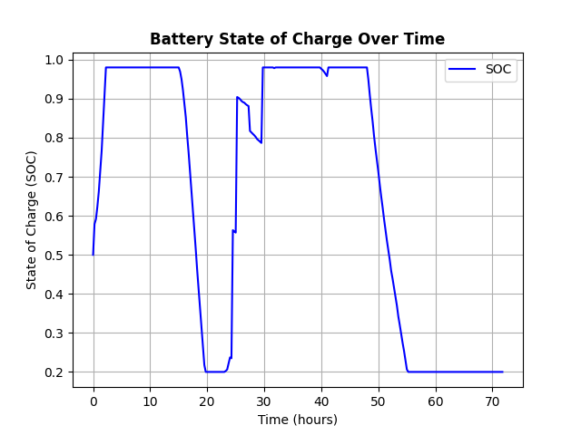
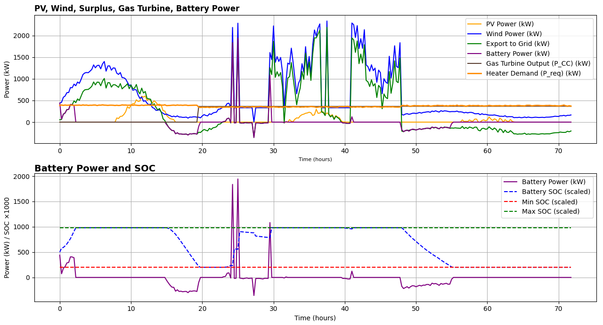
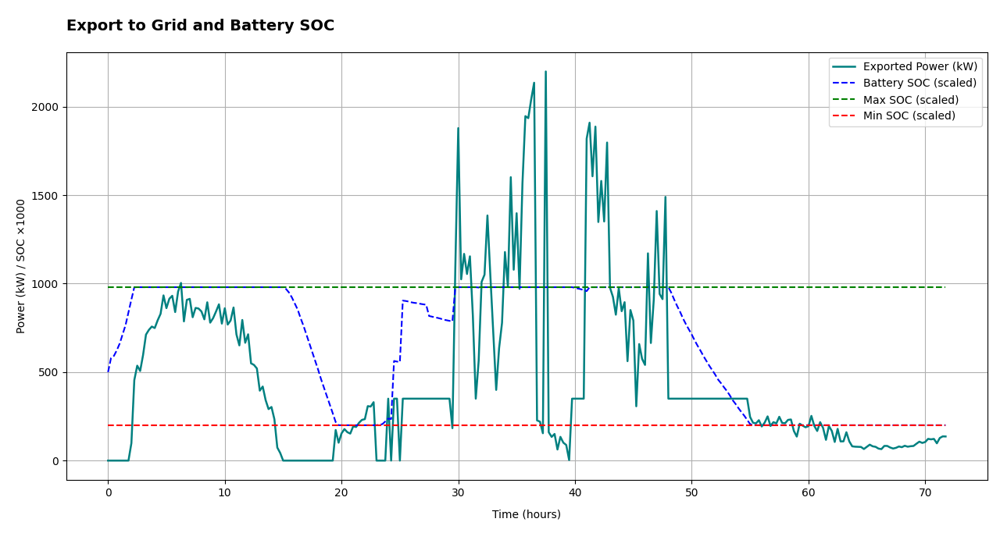
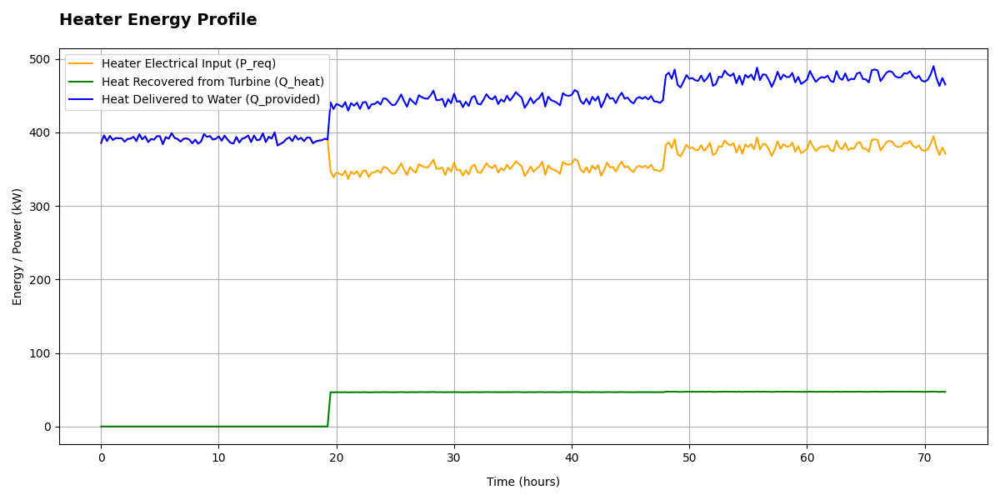
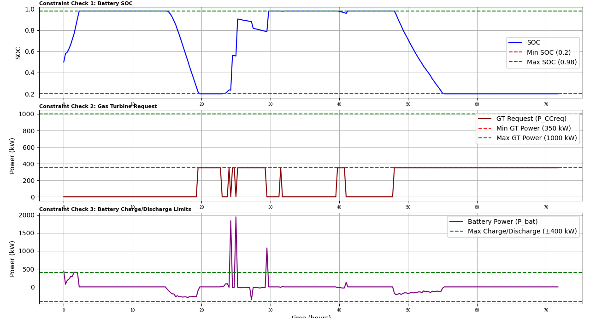
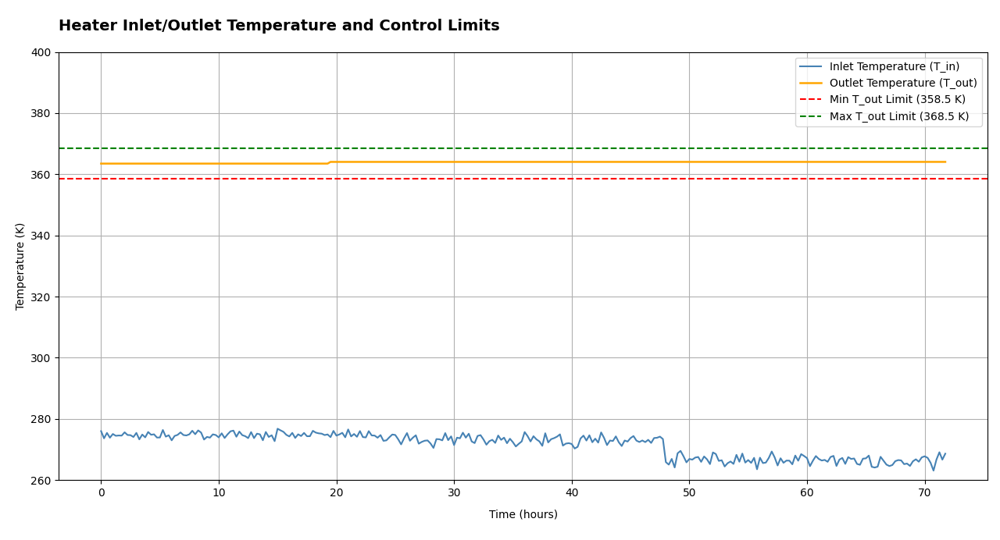

# 🌍 Co-Simulation of a Hybrid Renewable Energy System for District Heating in Cold Climates

A smart, modular, and real-time controlled energy system designed for Swedish winters — combining PV, wind, gas turbine, and battery FMUs in Python.

---

## 📖 Introduction

In frigid countries like Sweden, heating can account for up to **70%** of residential energy demand — especially during winter. But fossil-fueled systems pose both environmental and economic concerns under volatile weather.

This project tackles that challenge by simulating a **smart hybrid renewable energy system** that ensures:

- 🔥 Constant thermal output  
- 🌱 Prioritization of renewables  
- 🧠 Dynamic control using a Python-based co-simulation framework  

Each subsystem — PV, Wind, Battery, Gas Turbine, Heater, Controller — is modeled in **OpenModelica**, exported as **FMUs**, and integrated in **Python** through real-time orchestration logic.

> **The result?** A smart, reactive microgrid that thinks, adapts, and heats — efficiently.

---

## 🎯 Objectives

- ✅ Maintain **363.5 K** outlet temperature at all times  
- ✅ Prioritize **renewable energy** (PV + Wind)  
- ✅ Use **battery storage** to absorb surplus and supply deficit  
- ✅ Activate **gas turbine** only when necessary  
- ✅ Export to **grid** only when storage is full  

---

## 🧠 System Overview

### Components

- ☀️ **PV FMU** – generates electricity based on irradiance  
- 🌬 **Wind Turbine FMU** – complements solar, especially at night  
- 🔋 **Battery FMU** – buffers surplus and meets shortfalls  
- 🔥 **Gas Turbine FMU** – dispatchable power & heat with efficiency recovery  
- ♨️ **Heater FMU** – uses electricity + recovered heat to heat water  
- 🧠 **Controller FMU** – smart logic to dispatch power and balance constraints  

### Simulation Context

- 📅 Realistic **3-day Swedish winter** with sunny, rainy, and snowy periods  
- 📥 Inputs: 15-min interval irradiance, wind speed, ambient & water temperatures  
- ⏱ Time step: **900 seconds**

---

## 🗂 Project Structure

├── project.py # Main co-simulation script
├── plottedfigures.py # Plotting script for result analysis
├── data.csv # Environmental input data
├── results.csv # Output simulation results
├── myFMU/
│ └── myFMU.py # FMU wrapper class
├── FMUDir/systemproject/
│ ├── PV_model.fmu
│ ├── WindT.fmu
│ ├── BatteryModel.fmu
│ ├── GasTurbine.fmu
│ ├── Heater.fmu
│ └── lo.fmu
└── CO-SIMULATION REPORT 20-05-2025.pdf

---

## 🧪 How It Works

1. `project.py` reads data from `data.csv`
2. All FMUs are instantiated via a Python wrapper
3. Every 15-minute interval:
   - PV & Wind generate power based on weather
   - Controller decides:
     - 🔥 Gas Turbine output
     - 🔋 Battery charge/discharge
     - ⚡ Grid export logic
   - Heater uses power to heat water
4. Data stored in `results.csv`
5. `plottedfigures.py` generates insightful plots

---

## 📊 Plots & Analytics

By running `plottedfigures.py`, you can generate:

- 🔋 Battery SOC vs Time
- ⚡ PV, Wind, and Gas Turbine vs Heater Demand
- 🔄 Grid Export vs SOC
- ♨️ Heater Inlet/Outlet Temperature vs Time 
- 🚨 Constraint Compliance Charts:
- SOC bounds 


## ✅ Results Summary

| Metric                 | Result                          |
|------------------------|---------------------------------|
| Heater outlet temp     | Maintained at ~363.5 K          |
| PV & Wind Utilization  | Maximized                       |
| Gas Turbine Usage      | Only when needed                |
| Battery SOC Range      | Always within 0.2 – 0.98        |
| Grid Export            | Only when SOC ≥ 0.98            |
| Constraint Violations  | None                            |
| Gas Turbine Limits     | (350–1000 kW)                   |
| Battery charge/discharge   | (±400 kW)                   |


## 🚀 To Run the Simulation

1. **Install dependencies**:
   ```bash
   pip install pandas matplotlib fmpy

FMUDir/systemproject/*.fmu
python project.py
python plottedfigures.py
