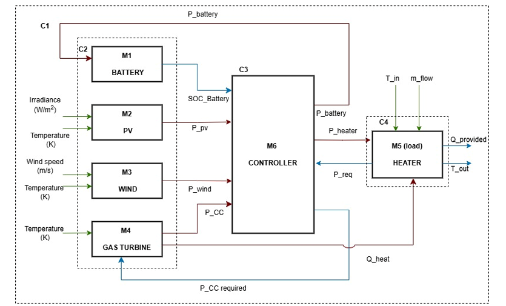

# Co-Simulation of a Hybrid Renewable Energy System for District Heating in Cold Climates

[](https://openmodelica.org/)
[](https://www.python.org/)

A smart, modular, and real-time controlled energy system designed for Swedish winters combining PV, wind, gas turbine, and battery FMUs in Python.

## Introduction

In frigid countries like Sweden, heating can account for up to **70%** of residential energy demand — especially during winter. But fossil-fueled systems pose both environmental and economic concerns under volatile weather.

This project tackles that challenge by simulating a **smart hybrid renewable energy system** that ensures:

- Constant thermal output  
- Prioritization of renewables  
- Dynamic control using a Python-based co-simulation framework  

Each subsystem — PV, Wind, Battery, Gas Turbine, Heater, Controller — is modeled in **OpenModelica**, exported as **FMUs**, and integrated in **Python** through real-time orchestration logic.

> **The result?** A smart, reactive microgrid that thinks, adapts, and heats efficiently.

## Objectives

-  Maintain **363.5 K** outlet temperature at all times  
-  Prioritize **renewable energy** (PV + Wind)  
-  Use **battery storage** to absorb surplus and supply deficit  
-  Activate **gas turbine** only when necessary  
-  Export to **grid** only when storage is full  

## System Overview

### Components

-  **PV FMU** – generates electricity based on irradiance  
-  **Wind Turbine FMU** – Complements solar generation by converting wind speed into electrical power
-  **Battery FMU** – Stores excess renewable energy and provides power during shortages
-  **Gas Turbine FMU** – dispatchable power & heat with efficiency recovery  
-  **Heater FMU** – uses electricity + recovered heat to heat water  
-  **Supervisory Controller FMU** – smart logic to dispatch power and balance constraints  

### Overview 
Block diagram showing Hybrid electrical system with its inputs & outputs 
### Simulation Context

-  Realistic **3-day Swedish winter** with sunny, rainy, and snowy periods  
-  Inputs: 15-min interval irradiance, wind speed, ambient & water temperatures  
-  Time step: **900 seconds**

## System Parameters

| **Battery**                    | **Photovoltaic (PV)**         | **Wind Turbine**             |
|-------------------------------|-------------------------------|------------------------------|
| Energy capacity: 1.4 MWh      | Panels: 10,000                | Rated power: 350,000 W       |
| Max power: 400,000 W          | Panel power: 300 W            | Cut-in/out speeds: model-specific |
| SOC init: 0.5                 | Irradiance ref: 1000 W/m²     | Efficiency: ~90% (assumed)   |
| SOC min/max: 0.2 / 0.98       | Temp coeff: 0.004 1/°C        |                              |
|                               | Efficiency: 25%               |                              |
|                               | Voltage (assumed): 24 V       |                              |

| **Gas Turbine**               | **Heater**                    | **Controller**               |
|------------------------------|-------------------------------|------------------------------|
| Electrical η: 0.35           | Cp_water: 4186 J/(kg·K)       | SOC limits: 0.2 – 0.98       |
| Thermal η: 0.45              | Efficiency: 0.95              | GT power: 350kW – 1MW        |
| Power min/max: 350kW / 1MW  | Max power: 11,000,000 W       | Battery cap: 1.4 MWh         |
|                              | Setpoint temp: 363.5 K        | Time step: 900 s             |


##  How It Works
1.  The system components are modelled on open-modellica and saved as FMU files
2. All FMUs are instantiated via a Python wrapper
3. `project.py` imports component models from `myFMU` and reads data from `data.csv` 
4. Every 15-minute interval:
   - PV & Wind generate power based on weather data
   - Controller decides:
     - Gas Turbine output
     - Battery charge/discharge within SOC constraints are met
     - Grid export logic
     - Balancing renewable generation, battery use, and gas turbine support to meet heater demand
   - Heater uses power to heat water to desired temperature while respecting limits
5. Data stored in `results.csv`
6. `plottedfigures.py` generates insightful plots

## Plots & Analytics

By running `plottedfigures.py`, the following results were obtained:

| **Figure** | **Description** |
|------------|-----------------|
| <br><br>**Fig 1**: Power contributions from PV, Wind, and Gas Turbine | Heater demand: **400 kW**. Gas turbine kicks in >**350 kW**. Power exported only when battery is full. |
| <br><br>**Fig 2**: Grid Export vs SOC | Export occurs when SOC reaches **~0.98**. Battery prioritized before export. |
| <br><br>**Fig 3**: Heater Inlet/Outlet Temperature | Inlet: **250–280 K**. Outlet stable at **~363.5 K**. Heater setpoint maintained. |
| <br><br>**Fig 4**: Constraint Compliance | SOC: **0.2–0.98**, Turbine: **350 kW–1 MW**, Battery: **±400 kW**. All within limits. |
| <br><br>**Fig 5**: SOC Bounds | SOC stays between **0.2** and **0.98** during full simulation. |
| <br><br>**Fig 6**: Battery SOC vs Time | SOC rises with surplus, drops during deficit. Starting at **0.5**. |


## Results Summary

| Metric                 | Result                          |
|------------------------|---------------------------------|
| Heater outlet temp     | Maintained at ~363.5 K          |
| PV & Wind Utilization  | Maximized                       |
| Gas Turbine Usage      | Only when needed                |
| Battery SOC Range      | Always within 0.2 – 0.98        |
| Grid Export            | Only when SOC ≥ 0.98            |
| Constraint Violations  | None                            |
| Gas Turbine Limits     | (350–1000 kW)                   |
| Battery charge/discharge   | (±400 kW)                   |


## To Run the Simulation

1. **Install dependencies**:
   ```bash
   pip install pandas matplotlib fmpy

FMUDir/systemproject/*.fmu
python project.py
python plottedfigures.py
